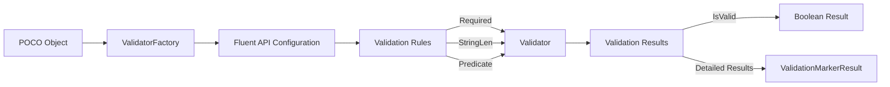

## DynamicVNET - Overview
[](https://www.nuget.org/packages/DynamicVNET/1.4.1)
[](https://github.com/rasulhsn/DynamicVNET/blob/master/LICENSE)

DynamicVNET is a **.NET Standard library** designed to provide reusable, dynamic validation. It allows developers to build custom validation rules for **POCOs** (Plain Old CLR Objects) and integrate validation into private or third-party libraries seamlessly. With its **Fluent API** interface, wrapped over **DataAnnotation** attributes, DynamicVNET delivers a rich and flexible validation library for cross-platform environments.  

## Key Features  
- **Branching & Nested Branching**: Create complex validation rules with ease.  
- **Nested Members**: Validate properties of nested objects.  
- **Value Types & Single Primitives**: Validate scalar types such as integers and strings.  
- **Reference Types**: Validate custom objects and classes.  
- **Automatic Repeated Validation Ignoring**: Avoid redundant validation checks.  
- **Strongly Self Validator**: Leverage inheritance for reusable and self-contained validators.  

## Use Cases  
DynamicVNET is suitable for a variety of scenarios, including:  
- **POCO Validation**: Define and enforce validation rules for simple objects.  
- **Dynamic Validation for Libraries**: Validate objects in private or third-party libraries (e.g., `.dll` files).  

## Validation Methods  
DynamicVNET supports a wide range of validation methods:  
- `Predicate` (Custom logic)  
- `StringLen` (String length)  
- `EmailAddress` (Email validation)  
- `Url` (Validates URLs for GET requests)  
- `Required` (Ensures non-null or non-empty values)  
- `MaxLen` (Maximum string length)  
- `RegularExp` (Regex-based validation)  
- `Range` (Range validation)  
- `Null` (Only for reference types)  
- `NotNull` (Only for reference types)  
- `GreaterThan` (Numeric comparison)  
- `LessThan` (Numeric comparison)  

### Example



POCO Models.
```csharp
public class Employee
{
   public string Name { get; set; }
   public Token TokenNumber { get; set; }
   public string Email { get; set; }
   
}
public class Token
{
   public string Number { get; set; }
}
```
Validation.
```csharp
Employee emp = new Employee()
{
    Name = "Jhon", 
    TokenNumber = new Token() { Number = "2312412312341" }, 
    Email = "jhon.sim@gmail.com"
};

var validator = ValidatorFactory.Create<Employee>(builder => {
                    builder.StringLen(x => x.Name, 4)
                            .EmailAddress(x => x.Email)
                            .Predicate(x => x.Email.Contains("@simple.com"))
                            .Required(x => x.TokenNumber.Number) //  nested member
                            .Required(x => x.TokenNumber.Number); // automatic ignored
                });        

bool result = validator.IsValid(emp);
``` 

```csharp
// Detailed Result
IEnumerable<ValidationMarkerResult> results = validator.Validate(emp);
```
#### Branch Example
```csharp
 var validator = ValidatorFactory.Create<Model>(builder => {
    builder.Required(x => x.Token.TokenNumber)
            .Branch(x => x.Name.Contains("resul"), x =>
             {
                 x.Required(y => y.Email)
                 .StringLen(y => y.Email, 2)
                     .Branch(n => n.Name.Length >= 4,n => {
                          n.MaxLen(s => s.Token.TokenNumber, length: 4);
                       });
            }).Branch(x => x.Email.Contains("aa"), x =>
              {
                  x.Required(y => y.Name)
                  .StringLen(y => y.Name, 5)
                  .StringLen(y => y.Token.TokenNumber, 9);
             });     
 });
```

## Example Strongly Self Validator

```csharp
public class EmployeeValidator : BaseValidator<Employee>
{
      protected override void Setup(ValidatorBuilder<Employee> builder)
      {
           builder.For(x => x.Name)
                  .Required();

           builder.Branch(x => x.Name.Contains("Jhon"), x =>
                   {
                      x.MaxLen(m => m.TokenNumber.Number, 15);
                   })
                   .For(x => x.Email)
                    .Required()
                    .EmailAddress();

           builder.Required(x => x.TokenNumber.Number);
      }
}
 
Employee emp = new Employee()
{
    Name = "Jhon Simon", 
    TokenNumber = new Token() { Number = "ASD123123" }, 
    Email = "jhon.sim@jhona.com"
};
 
 var empValidator = new EmployeeValidator();
 bool result = empValidator.IsValid(emp);
```

### Where can I get it?

Install [DynamicVNET](https://www.nuget.org/packages/DynamicVNET/) from the package manager console:

```
PM> Install-Package DynamicVNET -Version 1.4.1
```

### Copyright

[DynamicVNET](https://github.com/rasulhsn/DynamicVNET) is Copyright © 2018 Rasul Huseynov.
